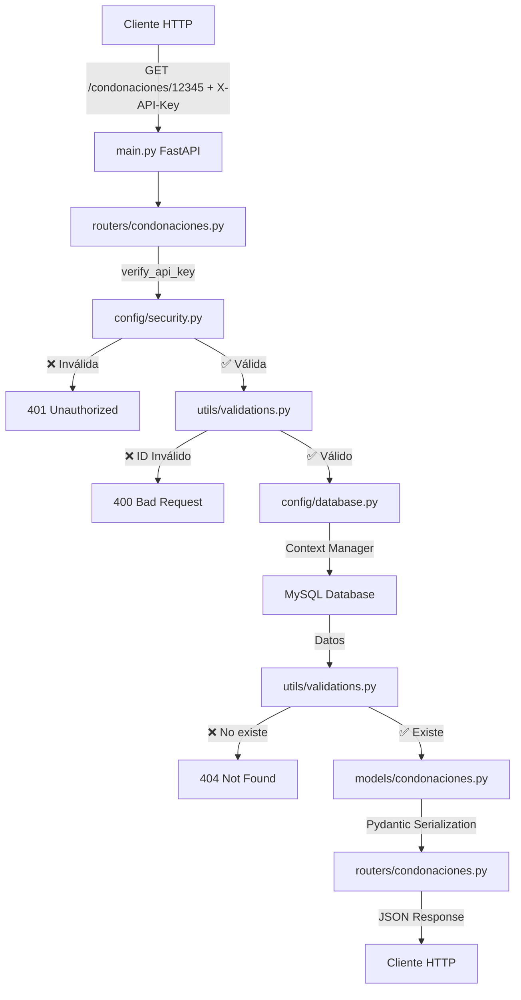

# 📚 DOCUMENTACIÓN TÉCNICA - API DE CONDONACIONES


**Versión:** 1.0.0  
**Fecha:** Enero 2026  
**Estado:** En Producción

---

## 📋 Tabla de Contenidos

- [1. Resumen Ejecutivo](#1-resumen-ejecutivo)
- [2. Herramientas y Tecnologías](#2-herramientas-y-tecnologías)
- [3. Arquitectura del Proyecto](#3-arquitectura-del-proyecto)
- [4. Implementación de Seguridad](#4-implementación-de-seguridad)
- [5. Estructura del JSON](#5-estructura-del-json)
- [6. Guía de Consumo](#6-guía-de-consumo)
- [7. Documentación Interactiva](#7-documentación-interactiva)
- [8. Configuración y Despliegue](#8-configuración-y-despliegue)

---

## 1. Resumen Ejecutivo

La **API de Condonaciones** es un servicio REST desarrollado en Python que permite consultar información sobre gastos de cobranza condonados asociados a créditos específicos. Su función principal es exponer de forma segura y eficiente los datos almacenados en bases de datos MySQL.

### 🎯 Funcionalidades Principales

- ✅ Consulta de datos generales del cliente y crédito
- ✅ Historial de gastos de cobranza condonados
- ✅ Información de períodos, montos, parcialidades y fechas
- ✅ Autenticación mediante API Key
- ✅ Respuestas estructuradas en JSON
- ✅ Códigos HTTP estandarizados

### 🔒 Características de Seguridad

- Autenticación por API Key
- Validación automática de entrada con Pydantic
- Consultas SQL parametrizadas (protección contra inyección)
- Validación personalizada contra patrones sospechosos
- Gestión segura de conexiones a base de datos

---

## 2. Herramientas y Tecnologías

### 🐍 Lenguaje de Programación

- **Python 3.x** - Lenguaje principal de desarrollo

### 🛠️ Frameworks y Librerías

| Categoría | Tecnología | Versión | Propósito |
|-----------|-----------|---------|-----------|
| **Framework Web** | FastAPI | 0.109.0 | API REST de alto rendimiento |
| **Servidor ASGI** | Uvicorn | 0.27.0 | Servidor para FastAPI |
| **Validación** | Pydantic | 2.5.3 | Validación de datos y serialización |
| **Base de Datos** | PyMySQL | 1.1.0 | Conector MySQL |
| **Configuración** | python-dotenv | 1.0.1 | Gestión de variables de entorno |
| **Utilidades** | python-multipart | 0.0.6 | Manejo de form-data |

#### ⚡ Características de FastAPI

- Validación automática de datos con Pydantic
- Documentación interactiva automática (Swagger UI)
- Soporte nativo para async/await
- Inyección de dependencias integrada
- Alto rendimiento (comparable con NodeJS y Go)

---

## 3. Arquitectura del Proyecto

### 🏗️ Patrón Arquitectónico

El proyecto implementa una **arquitectura por capas (Layered Architecture)** con separación clara de responsabilidades:

```
┌─────────────────────────────────────┐
│   Capa de Presentación (Routers)   │  ← Exposición de endpoints
├─────────────────────────────────────┤
│  Capa de Lógica de Negocio (Utils) │  ← Validaciones y reglas
├─────────────────────────────────────┤
│ Capa de Acceso a Datos (Database)  │  ← Conexión a BD
├─────────────────────────────────────┤
│     Capa de Modelo (Models)        │  ← Estructuras de datos
├─────────────────────────────────────┤
│   Capa de Seguridad (Security)     │  ← Autenticación
└─────────────────────────────────────┘
```

### 📂 Estructura de Directorios

```
api_python/
│
├── 📄 main.py                      # Punto de entrada de la aplicación
├── 📄 requirements.txt             # Dependencias del proyecto
├── 📄 README.md                    # Documentación básica
├── 📄 DOCUMENTACION_TECNICA.md     # Este documento
│
├── 📁 config/                      # Configuraciones globales
│   ├── __init__.py
│   ├── database.py                 # Configuración de conexión a BD
│   └── security.py                 # Sistema de autenticación API Key
│
├── 📁 models/                      # Modelos de datos (Pydantic)
│   ├── __init__.py
│   └── condonaciones.py            # Esquemas de entrada/salida
│
├── 📁 routers/                     # Endpoints de la API
│   ├── __init__.py
│   └── condonaciones.py            # Rutas de condonaciones
│
└── 📁 utils/                       # Utilidades y validaciones
    ├── __init__.py
    └── validations.py              # Funciones de validación de datos
```

### 🔄 Flujo de Comunicación entre Componentes



### 💻 Ejemplos de Código Real

#### 🔌 config/database.py - Gestión de Conexiones

```python
from contextlib import contextmanager
import pymysql

@contextmanager
def get_db_connection(database: str = None):
    """Context manager para conexión segura a base de datos"""
    connection = pymysql.connect(
        host="TU_HOST",
        port=3306,
        user="TU_USUARIO",
        password="TU_PASSWORD",
        database=database or "db-mega-reporte",
        charset='utf8mb4',
        cursorclass=pymysql.cursors.DictCursor
    )
    
    try:
        yield connection
    finally:
        connection.close()  # ✅ Cierre automático garantizado
```

#### 🛣️ routers/condonaciones.py - Endpoint Principal

```python
from fastapi import APIRouter, Path, Security
from config.security import verify_api_key
from utils.validations import validar_id_credito, validar_datos_encontrados

router = APIRouter()

@router.get("/condonaciones/{id_credito}")
async def get_condonacion_por_credito(
    id_credito: int = Path(..., gt=0),
    api_key: str = Security(verify_api_key)  # 🔒 Inyección de dependencia
):
    """Obtiene condonaciones por ID de crédito"""
    
    # 1️⃣ Validar entrada
    validar_id_credito(id_credito)
    
    # 2️⃣ Consultar BD con context manager
    with get_db_connection() as conn:
        with conn.cursor() as cursor:
            cursor.execute(
                """SELECT Id_credito, Nombre_cliente, Dias_mora 
                   FROM tbl_segundometro_semana 
                   WHERE Id_credito = %s""",
                (id_credito,)  # ✅ Parámetro vinculado (seguro)
            )
            datos_generales_row = cursor.fetchone()
    
    # 3️⃣ Validar resultado
    validar_datos_encontrados(datos_generales_row, 'cliente', id_credito)
    
    # 4️⃣ Convertir a modelo Pydantic
    datos_generales = DatosGenerales(**datos_generales_row)
    
    # 5️⃣ Retornar respuesta estructurada
    return CondonacionResponse(
        status_code=200,
        success=True,
        mensaje="Consulta exitosa",
        datos_generales=datos_generales
    )
```

#### 🛡️ utils/validations.py - Validación contra Inyecciones

```python
from fastapi import HTTPException, status

def validar_id_credito(id_credito: int) -> None:
    """Valida ID de crédito contra patrones sospechosos"""
    
    # ✅ Validación básica
    if id_credito <= 0:
        raise HTTPException(
            status_code=400, 
            detail="ID debe ser mayor a 0"
        )
    
    # 🚨 Detectar patrones repetitivos (1111111, 2222222)
    id_str = str(id_credito)
    if len(set(id_str)) == 1:  # Todos los dígitos iguales
        raise HTTPException(
            status_code=400, 
            detail="ID con patrón inválido"
        )
    
    # 🛡️ Validar límite máximo (prevenir overflow)
    if id_credito > 999999999:
        raise HTTPException(
            status_code=400, 
            detail="ID excede límite máximo"
        )
```

#### 🔐 config/security.py - Autenticación API Key

```python
from fastapi import HTTPException, Security
from fastapi.security import APIKeyHeader
import os

API_KEY_NAME = "X-API-Key"
api_key_header = APIKeyHeader(name=API_KEY_NAME, auto_error=True)

# 🔑 API Keys desde archivo .env
VALID_API_KEYS = os.getenv("API_KEYS", "").split(",")

async def verify_api_key(api_key: str = Security(api_key_header)) -> str:
    """Verifica validez del API Key"""
    if api_key not in VALID_API_KEYS:
        raise HTTPException(
            status_code=401,
            detail="API Key inválida o no autorizada"
        )
    return api_key
```

---

## 4. Implementación de Seguridad

La API implementa **múltiples capas de seguridad** para proteger la información y prevenir ataques comunes.

### 🔐 Capa 1: Autenticación mediante API Key

#### Descripción

Sistema de autenticación basado en tokens estáticos almacenados en variables de entorno. Cada petición debe incluir un header `X-API-Key` con una clave válida.

#### Flujo de Autenticación

```
1. Cliente → Header: X-API-Key: TU_API_KEY
2. FastAPI → Extrae header (APIKeyHeader)
3. verify_api_key() → Valida contra VALID_API_KEYS
4. ❌ Inválida → 401 Unauthorized
5. ✅ Válida → Acceso permitido
```

#### Protección que Provee

| Protección | Descripción |
|------------|-------------|
| 🚫 **Acceso no autorizado** | Solo clientes con API Key válida pueden acceder |
| 📝 **Auditoría** | Cada API Key puede asociarse a un cliente específico |
| ⚡ **Revocación instantánea** | Remover clave del .env bloquea acceso inmediatamente |
| 🔒 **Sin exposición** | Las claves nunca se escriben en código fuente |

#### Ejemplo de Configuración

```env
# .env
API_KEYS=clave_cliente1_32caracteres,clave_cliente2_32caracteres
```

### 🛡️ Capa 2: Validación de Entrada (Input Validation)

#### Validación Automática con Pydantic

FastAPI + Pydantic validan automáticamente todos los parámetros de entrada:

```python
@router.get("/condonaciones/{id_credito}")
async def get_condonacion_por_credito(
    id_credito: int = Path(..., description="ID del crédito", gt=0)
    # gt=0 significa "greater than zero"
):
```

**Protección:**
- ❌ Si `id_credito` no es entero → **422 Unprocessable Entity**
- ❌ Si `id_credito` ≤ 0 → **422 Unprocessable Entity**
- ❌ Si `id_credito` está ausente → **422 Unprocessable Entity**

#### Validación Personalizada

```python
def validar_id_credito(id_credito: int) -> None:
    # ✅ Validar que no sea 0 o negativo
    if id_credito <= 0:
        raise HTTPException(status_code=400, detail="ID debe ser mayor a 0")
    
    # 🚨 Detectar patrones repetitivos (fuzzing attacks)
    # Ejemplo: 1111111, 2222222
    id_str = str(id_credito)
    if len(set(id_str)) == 1:
        raise HTTPException(status_code=400, detail="Patrón inválido")
    
    # 🛡️ Validar límite máximo (prevenir overflow)
    if id_credito > 999999999:
        raise HTTPException(status_code=400, detail="ID excede límite")
```

**Previene:**
- 💉 SQL Injection
- 🎯 Fuzzing attacks
- 💥 Integer overflow

### 💉 Capa 3: Consultas Parametrizadas (Prepared Statements)

#### ❌ INCORRECTO (Vulnerable)

```python
query = f"SELECT * FROM clientes WHERE id_credito = {id_credito}"
cursor.execute(query)
```

#### ✅ CORRECTO (Seguro)

```python
query = "SELECT * FROM clientes WHERE id_credito = %s"
cursor.execute(query, (id_credito,))  # PyMySQL escapa automáticamente
```

**Protección:**
- ✅ PyMySQL escapa automáticamente valores peligrosos
- ✅ Imposibilita inyección SQL: `1 OR 1=1; DROP TABLE--`
- ✅ Maneja comillas y caracteres especiales

### 🌐 Capa 4: CORS (Cross-Origin Resource Sharing)

```python
app.add_middleware(
    CORSMiddleware,
    allow_origins=["https://tudominio.com"],  # 🔒 Lista específica en producción
    allow_credentials=True,
    allow_methods=["GET"],  # 📌 Solo GET (API de consulta)
    allow_headers=["X-API-Key", "Content-Type"],
)
```

**Protección:**
- 🚫 Previene consumo desde sitios maliciosos
- 📝 Limita métodos HTTP
- 🎯 Control granular de headers

### 🔌 Capa 5: Gestión de Conexiones

```python
@contextmanager
def get_db_connection(database: str = None):
    connection = pymysql.connect(...)
    
    try:
        yield connection
    finally:
        connection.close()  # ✅ SIEMPRE se ejecuta
```

**Protección:**
- ✅ Previene agotamiento de conexiones
- ✅ Evita bloqueos de base de datos
- ✅ Libera recursos automáticamente

### 📊 Capa 6: Códigos HTTP Estandarizados

| Código | Mensaje | Cuándo se Usa |
|--------|---------|---------------|
| 🟢 **200** | OK | Consulta exitosa con datos |
| 🟡 **400** | Bad Request | ID inválido o parámetros mal formados |
| 🔴 **401** | Unauthorized | API Key faltante o inválida |
| 🔴 **404** | Not Found | Crédito no existe en la base de datos |
| 🟡 **422** | Unprocessable Entity | Error de validación Pydantic |
| 🔴 **500** | Internal Server Error | Error no controlado (BD caída) |

#### Estructura de Respuesta Estandarizada

**✅ Éxito:**
```json
{
  "status_code": 200,
  "status_message": "OK",
  "success": true,
  "mensaje": "Se encontraron 3 gastos condonados",
  "datos_generales": { ... },
  "condonacion_cobranza": { ... }
}
```

**❌ Error:**
```json
{
  "status_code": 401,
  "status_message": "Unauthorized",
  "success": false,
  "mensaje": "API Key inválida o no autorizada"
}
```

### 🚨 Capa 7: Manejadores Globales de Excepciones

```python
@app.exception_handler(HTTPException)
async def http_exception_handler(request, exc: HTTPException):
    return JSONResponse(
        status_code=exc.status_code,
        content={
            "status_code": exc.status_code,
            "status_message": HTTP_STATUS_MESSAGES.get(exc.status_code),
            "success": False,
            "mensaje": exc.detail  # ✅ Mensaje controlado, no stack trace
        }
    )
```

**Protección:**
- 🚫 Evita exponer stack traces
- 🔒 Previene information disclosure
- 🌍 Mensajes en español y user-friendly

---

## 5. Estructura del JSON

### 📦 Objeto Raíz (CondonacionResponse)

| Campo | Tipo | Obligatorio | Descripción |
|-------|------|-------------|-------------|
| `status_code` | integer | ✅ | Código HTTP (200, 400, 401, 404, 422, 500) |
| `status_message` | string | ✅ | Descripción del código HTTP |
| `success` | boolean | ✅ | `true` = exitosa, `false` = error |
| `mensaje` | string | ✅ | Mensaje descriptivo en español |
| `datos_generales` | object | ⚠️ | Info del cliente/crédito. `null` si no existe |
| `condonacion_cobranza` | object | ⚠️ | Gastos de cobranza. `null` en error |

### 👤 Objeto datos_generales (DatosGenerales)

| Campo | Tipo | Nullable | Descripción | Ejemplo |
|-------|------|----------|-------------|---------|
| `id_credito` | integer | ✅ | ID único del crédito | `12345` |
| `nombre_cliente` | string | ✅ | Nombre completo del cliente | `"Juan Pérez García"` |
| `id_cliente` | integer | ✅ | ID único del cliente | `67890` |
| `domicilio_completo` | string | ✅ | Dirección completa | `"Calle Principal #123"` |
| `bucket_morosidad` | string | ✅ | Clasificación de morosidad | `"B2"` |
| `dias_mora` | integer | ✅ | Días en mora | `15` |
| `saldo_vencido` | float | ✅ | Saldo vencido | `3500.00` |

### 💰 Objeto condonacion_cobranza (CondonacionCobranza)

| Campo | Tipo | Obligatorio | Descripción |
|-------|------|-------------|-------------|
| `detalle` | array | ✅ | Arreglo de `DetalleCondonacion`. Puede estar vacío `[]` |

### 📄 Objeto detalle[] (DetalleCondonacion)

| Campo | Tipo | Nullable | Descripción | Ejemplo |
|-------|------|----------|-------------|---------|
| `periodoinicio` | date | ✅ | Fecha inicio periodo (ISO 8601) | `"2026-01-01"` |
| `periodofin` | date | ✅ | Fecha fin periodo (ISO 8601) | `"2026-01-07"` |
| `semana` | string/integer | ✅ | Identificador de semana | `"2026-01"` o `1` |
| `parcialidad` | string/integer | ✅ | Número de parcialidad | `"1/52"` o `1` |
| `monto_valor` | float | ✅ | Monto del gasto | `150.50` |
| `cuota` | float | ✅ | Monto de la cuota | `150.00` |
| `condonado` | integer | ✅ | `1` = condonado, `0` = no condonado | `1` |
| `fecha_condonacion` | datetime | ✅ | Fecha/hora de condonación (ISO 8601) | `"2026-01-28T10:30:00"` |

> **⚠️ Nota:** El arreglo `detalle` solo incluye gastos con `condonado = 1`

### 📋 Ejemplo Completo de Respuesta Exitosa

```json
{
  "status_code": 200,
  "status_message": "OK",
  "success": true,
  "mensaje": "Se encontraron 3 gastos condonados",
  "datos_generales": {
    "id_credito": 12345,
    "nombre_cliente": "María González López",
    "id_cliente": 67890,
    "domicilio_completo": "Av. Reforma #456, Col. Juárez, CDMX",
    "bucket_morosidad": "B3",
    "dias_mora": 45,
    "saldo_vencido": 8750.25
  },
  "condonacion_cobranza": {
    "detalle": [
      {
        "periodoinicio": "2026-01-01",
        "periodofin": "2026-01-07",
        "semana": "2026-01",
        "parcialidad": "1/52",
        "monto_valor": 150.50,
        "cuota": 150.00,
        "condonado": 1,
        "fecha_condonacion": "2026-01-28T10:30:00"
      },
      {
        "periodoinicio": "2026-01-08",
        "periodofin": "2026-01-14",
        "semana": "2026-02",
        "parcialidad": "2/52",
        "monto_valor": 175.00,
        "cuota": 150.00,
        "condonado": 1,
        "fecha_condonacion": "2026-01-28T10:30:00"
      },
      {
        "periodoinicio": "2026-01-15",
        "periodofin": "2026-01-21",
        "semana": "2026-03",
        "parcialidad": "3/52",
        "monto_valor": 200.75,
        "cuota": 150.00,
        "condonado": 1,
        "fecha_condonacion": "2026-01-28T10:30:00"
      }
    ]
  }
}
```

### 📭 Ejemplo: Sin Gastos Condonados

```json
{
  "status_code": 200,
  "status_message": "OK",
  "success": true,
  "mensaje": "No hay gastos condonados para este crédito",
  "datos_generales": {
    "id_credito": 54321,
    "nombre_cliente": "Carlos Ramírez Sánchez",
    "id_cliente": 98765,
    "domicilio_completo": "Calle Morelos #789, Col. Centro",
    "bucket_morosidad": "B1",
    "dias_mora": 5,
    "saldo_vencido": 500.00
  },
  "condonacion_cobranza": {
    "detalle": []
  }
}
```

### ❌ Ejemplos de Respuestas de Error

<details>
<summary><b>Error 400 - Bad Request</b></summary>

```json
{
  "status_code": 400,
  "status_message": "Bad Request",
  "success": false,
  "mensaje": "El ID del crédito debe ser mayor a 0"
}
```

</details>

<details>
<summary><b>Error 401 - Unauthorized</b></summary>

```json
{
  "status_code": 401,
  "status_message": "Unauthorized",
  "success": false,
  "mensaje": "API Key inválida o no autorizada"
}
```

</details>

<details>
<summary><b>Error 404 - Not Found</b></summary>

```json
{
  "status_code": 404,
  "status_message": "Not Found",
  "success": false,
  "mensaje": "No se encontró información del crédito 99999. Verifica que el ID sea correcto."
}
```

</details>

<details>
<summary><b>Error 422 - Unprocessable Entity</b></summary>

```json
{
  "status_code": 422,
  "status_message": "Unprocessable Entity",
  "success": false,
  "mensaje": "No se pudo convertir 'abc' a un número entero válido",
  "detail": [
    {
      "type": "int_parsing",
      "loc": ["path", "id_credito"],
      "msg": "Input should be a valid integer",
      "input": "abc"
    }
  ]
}
```

</details>

<details>
<summary><b>Error 500 - Internal Server Error</b></summary>

```json
{
  "status_code": 500,
  "status_message": "Internal Server Error",
  "success": false,
  "mensaje": "Error de base de datos: Connection timeout"
}
```

</details>

### 🔧 Consideraciones de Integración

#### Para Desarrolladores Frontend/Cliente

**1. Validar siempre el campo `success`:**
```javascript
if (response.success === true) {
  // ✅ Procesar datos
} else {
  // ❌ Mostrar error
  console.error(response.mensaje);
}
```

**2. Manejar arreglo vacío:**
```javascript
if (response.condonacion_cobranza.detalle.length === 0) {
  console.log("No hay gastos condonados");
}
```

**3. Validar campos nullable:**
```javascript
const nombreCliente = response.datos_generales.nombre_cliente || "No disponible";
```

**4. Parsear fechas:**
```javascript
const fecha = new Date(detalle.fecha_condonacion);
```

### 📘 Tipos para TypeScript

```typescript
interface CondonacionResponse {
  status_code: number;
  status_message: string;
  success: boolean;
  mensaje: string;
  datos_generales: DatosGenerales | null;
  condonacion_cobranza: CondonacionCobranza | null;
}

interface DatosGenerales {
  id_credito: number | null;
  nombre_cliente: string | null;
  id_cliente: number | null;
  domicilio_completo: string | null;
  bucket_morosidad: string | null;
  dias_mora: number | null;
  saldo_vencido: number | null;
}

interface CondonacionCobranza {
  detalle: DetalleCondonacion[];
}

interface DetalleCondonacion {
  periodoinicio: string | null;
  periodofin: string | null;
  semana: string | number | null;
  parcialidad: string | number | null;
  monto_valor: number | null;
  cuota: number | null;
  condonado: number | null;
  fecha_condonacion: string | null;
}
```

---

## 6. Guía de Consumo

### 🌐 URL Base

```
https://TU_SERVIDOR/api/v1
```

### 📍 Endpoint Disponible

#### `GET /condonaciones/{id_credito}`

Obtiene información completa de condonación para un crédito específico.

**Parámetros:**
- `id_credito` (integer, **obligatorio**): ID del crédito. Debe ser > 0

**Headers:**
- `X-API-Key` (string, **obligatorio**): API Key de autenticación
- `Content-Type`: `application/json`

### 📝 Ejemplos de Consumo

#### cURL

```bash
curl -X GET "https://TU_SERVIDOR/api/v1/condonaciones/12345" \
     -H "X-API-Key: tu_api_key_de_32_caracteres_aqui" \
     -H "Content-Type: application/json"
```

#### Python (requests)

```python
import requests

url = "https://TU_SERVIDOR/api/v1/condonaciones/12345"
headers = {
    "X-API-Key": "tu_api_key_de_32_caracteres_aqui",
    "Content-Type": "application/json"
}

response = requests.get(url, headers=headers)
data = response.json()

if data["success"]:
    print(f"Cliente: {data['datos_generales']['nombre_cliente']}")
    print(f"Gastos condonados: {len(data['condonacion_cobranza']['detalle'])}")
else:
    print(f"Error: {data['mensaje']}")
```

#### JavaScript (Fetch API)

```javascript
fetch('https://TU_SERVIDOR/api/v1/condonaciones/12345', {
  method: 'GET',
  headers: {
    'X-API-Key': 'tu_api_key_de_32_caracteres_aqui',
    'Content-Type': 'application/json'
  }
})
.then(response => response.json())
.then(data => {
  if (data.success) {
    console.log('Cliente:', data.datos_generales.nombre_cliente);
    console.log('Gastos condonados:', data.condonacion_cobranza.detalle.length);
  } else {
    console.error('Error:', data.mensaje);
  }
})
.catch(error => console.error('Error de red:', error));
```

#### Node.js (Axios)

```javascript
const axios = require('axios');

async function obtenerCondonaciones(idCredito) {
  try {
    const response = await axios.get(
      `https://TU_SERVIDOR/api/v1/condonaciones/${idCredito}`,
      {
        headers: {
          'X-API-Key': 'tu_api_key_de_32_caracteres_aqui',
          'Content-Type': 'application/json'
        }
      }
    );
    
    if (response.data.success) {
      console.log('Cliente:', response.data.datos_generales.nombre_cliente);
      return response.data;
    } else {
      throw new Error(response.data.mensaje);
    }
  } catch (error) {
    console.error('Error:', error.message);
  }
}

obtenerCondonaciones(12345);
```

---

## 7. Documentación Interactiva

FastAPI genera automáticamente documentación interactiva:

### 📚 Swagger UI
```
https://TU_SERVIDOR/docs
```


**Características:**
- ✅ Prueba endpoints directamente desde el navegador
- ✅ Visualiza esquemas de entrada/salida
- ✅ Valida respuestas en tiempo real
- ✅ Descarga especificación OpenAPI

### 📖 ReDoc
```
https://TU_SERVIDOR/redoc
```

**Características:**
- ✅ Documentación en formato limpio y profesional
- ✅ Búsqueda integrada
- ✅ Navegación por categorías
- ✅ Exportación a PDF

---

## 8. Configuración y Despliegue

### 🔧 Variables de Entorno (.env)

Crear archivo `.env` en la raíz del proyecto:

```env
# 🗄️ Base de Datos
DB_HOST=TU_HOST
DB_PORT=3306
DB_USER=TU_USUARIO
DB_PASSWORD=TU_PASSWORD
DB_DATABASE=db-mega-reporte

# 🔑 API Keys (separadas por comas)
API_KEYS=clave_cliente1_32caracteres,clave_cliente2_32caracteres

# 🌐 Servidor (opcional)
PORT=8000
HOST=0.0.0.0
```

### 📦 Instalación de Dependencias

```bash
# Crear entorno virtual
python -m venv venv

# Activar entorno virtual
# Windows:
venv\Scripts\activate
# Linux/Mac:
source venv/bin/activate

# Instalar dependencias
pip install -r requirements.txt
```

### 🚀 Ejecución en Desarrollo

```bash
uvicorn main:app --reload --host 0.0.0.0 --port 8000
```

**Flags:**
- `--reload`: Recarga automática al detectar cambios
- `--host 0.0.0.0`: Accesible desde la red
- `--port 8000`: Puerto del servidor

### 🏭 Ejecución en Producción

```bash
uvicorn main:app --host 0.0.0.0 --port 8000 --workers 4
```

**Flags:**
- `--workers 4`: 4 procesos worker para mayor rendimiento
- Sin `--reload`: Modo producción

### 🐳 Despliegue con Docker (Opcional)

```dockerfile
FROM python:3.11-slim

WORKDIR /app

COPY requirements.txt .
RUN pip install --no-cache-dir -r requirements.txt

COPY . .

EXPOSE 8000

CMD ["uvicorn", "main:app", "--host", "0.0.0.0", "--port", "8000", "--workers", "4"]
```

**Comandos:**
```bash
# Construir imagen
docker build -t api-condonaciones .

# Ejecutar contenedor
docker run -d -p 8000:8000 --env-file .env api-condonaciones
```

---

## 📊 Métricas y Monitoreo

### 🔍 Endpoints de Salud (Opcional)

```python
@app.get("/health")
async def health_check():
    return {"status": "healthy", "version": "1.0.0"}

@app.get("/")
async def root():
    return {
        "message": "API de Condonaciones",
        "version": "1.0.0",
        "docs": "/docs",
        "redoc": "/redoc"
    }
```

---

## 🐛 Troubleshooting

### Problemas Comunes

| Problema | Solución |
|----------|----------|
| **401 Unauthorized** | Verificar que el header `X-API-Key` esté presente y sea válido |
| **422 Unprocessable Entity** | Verificar que `id_credito` sea un entero positivo |
| **404 Not Found** | El crédito no existe en la base de datos |
| **500 Internal Server Error** | Revisar logs del servidor, posible error de BD |

### Logs

```bash
# Ver logs en tiempo real
uvicorn main:app --log-level debug
```

---

## 📞 Contacto y Soporte

Para preguntas técnicas, reportes de errores o solicitudes de nuevas funcionalidades:

- 📧 **Email**: soporte@tudominio.com
- 📚 **Documentación**: `/docs` y `/redoc`
- 🐛 **Reportar Bug**: [Sistema de tickets]

---

## 📄 Licencia

**Propietaria** - Todos los derechos reservados © 2026

---

## 🔄 Historial de Versiones

| Versión | Fecha | Cambios |
|---------|-------|---------|
| **1.0.0** | Enero 2026 | ✅ Lanzamiento inicial |

---

<div align="center">

**Desarrollado con ❤️ usando FastAPI**


</div>
